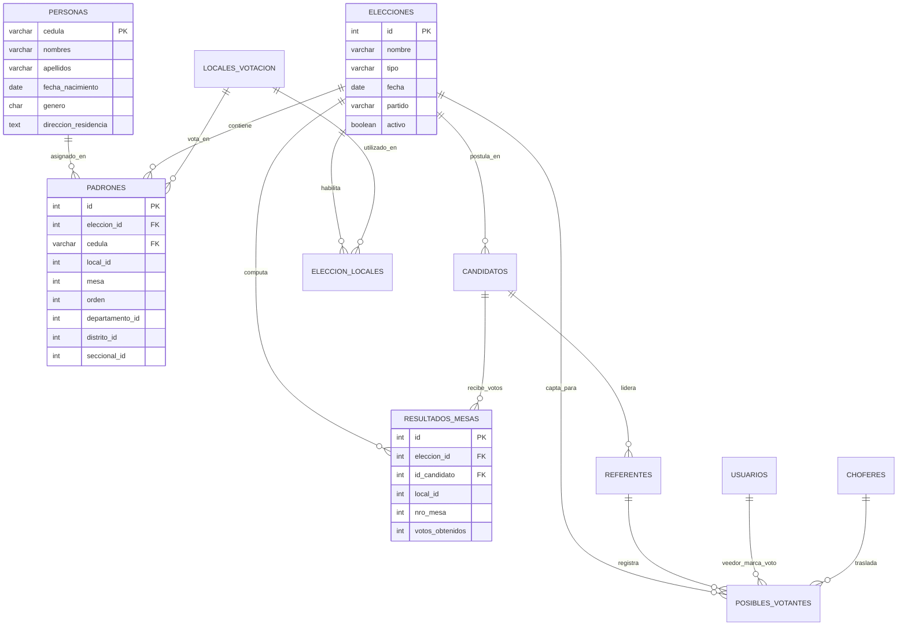

# INFORME TÉCNICO Y ARQUITECTURA DEL SISTEMA SIGEL
**Sistema Integral de Gestión Electoral**
*Versión de Arquitectura: 2.5 (Soporte Multi-Elección Total)*
*Fecha de actualización: Septiembre 2026*

---

## 1. Resumen Ejecutivo y Ficha Técnica

El **Sistema Integral de Gestión Electoral (SIGEL)** es una plataforma de software orientada a la planificación estratégica, logística de campo, captación territorial, mensajería multicanal, financiamiento político y escrutinio en tiempo real para procesos electorales en la República del Paraguay.

### 1.1 Stack Tecnológico Principal
* **Backend:** Python 3.13 con **FastAPI** (asíncrono).
* **ORM & Acceso a Datos:** SQLAlchemy 2.0 (AsyncSession) y **asyncpg** (driver de alto rendimiento para PostgreSQL).
* **Base de Datos:** **PostgreSQL 16** con extensiones **PostGIS** (geolocalización) y **pg_trgm / unaccent** (búsquedas difusas de votantes).
* **Frontend:** **React 18** empaquetado con **Vite**, React Leaflet para mapas interactivos y CSS nativo modular de alto rendimiento.
* **Seguridad:** Autenticación JWT, hasheo con **bcrypt**, control de acceso basado en roles (**RBAC**), auditoría por triggers/middleware y restricción de acceso por huella de dispositivo (**Device ID**).
* **Integraciones Externas:** N8N (automatización de flujos), Twilio (SMS/WhatsApp), Nominatim / Google Maps (geocodificación inversa).

---

## 2. Arquitectura de Desacoplamiento Multi-Elección

Uno de los mayores desafíos en sistemas electorales es evitar la duplicación de personas biográficas al gestionar múltiples elecciones (e.g. Internas Partidarias ANR, Internas PLRA, Elecciones Municipales Generales, Elecciones Nacionales o Comicios de Cooperativas).

SIGEL implementa un **modelo relacional desacoplado**:



### Principios Clave de la Independencia:
1. **Identidad Ciudadana Única (`electoral.personas`):**
   La persona física solo se almacena una vez por su número de cédula. Cambios en sus datos de contacto o residencia son globales.
2. **Empadronamiento Aislado (`electoral.padrones`):**
   Posee la restricción única `UNIQUE(eleccion_id, cedula)`. Una persona puede estar registrada en la Elección 1 (con su mesa/orden de una interna partidaria) y en la Elección 3 (con su mesa/orden del padrón general nacional) con total independencia y sin colisiones.
3. **Aislamiento en Escrutinio (`electoral.resultados_mesas`):**
   Cada acta de mesa está vinculada a un `eleccion_id`. Esto permite auditar los resultados de las internas y de las generales sin riesgo de sobrescritura de datos.
4. **Contexto Operativo en el Frontend:**
   La barra de navegación dispone de un **Selector de Elección Activa** persistente en `localStorage` que propaga el contexto a las pantallas de Captación de Votantes, Escrutinio Día D, Impresión de Padrones, Análisis Geográfico y Mensajería.

---

## 3. Diccionario Completo de la Base de Datos

La base de datos de producción (`SIGEL`) está organizada en tres esquemas lógicos:

### 3.1 Esquema `electoral` (Dominio del Negocio Electoral)

| Tabla | Propósito | Campos Clave | Relaciones / Notas |
| :--- | :--- | :--- | :--- |
| **`elecciones`** | Registro de procesos comiciales activos o históricos. | `id` (PK), `nombre`, `tipo`, `fecha`, `partido`, `activo` | Raíz de todo el árbol comicial. |
| **`personas`** | Repositorio maestro de ciudadanos paraguayos (~5 millones). | `cedula` (PK), `nombres`, `apellidos`, `fecha_nacimiento`, `genero`, `telefono`, `email`, `direccion_residencia` | Índices GIN trgm para búsquedas fonéticas ultrarrápidas. |
| **`padrones`** | Asignación de mesa y local de cada ciudadano para una elección. | `id` (PK), `eleccion_id` (FK), `cedula` (FK), `local_id`, `mesa`, `orden`, `seccional_id`, `distrito_id`, `departamento_id` | `UNIQUE(eleccion_id, cedula)`. Almacena >6.7M de registros. |
| **`candidatos`** | Perfil de candidatos a cargos electivos. | `id` (PK), `nombre_candidato`, `partido_movimiento`, `municipio`, `eleccion_id` (FK), `logo_url`, `activo` | Vinculado a elecciones y financiamiento. |
| **`referentes`** | Líderes territoriales y coordinadores de base. | `id` (PK), `id_usuario_sistema` (FK), `id_candidato` (FK), `id_superior` (FK), `nombre_referente`, `telefono`, `zona_influencia` | Estructura jerárquica en árbol (superior-subordinado). |
| **`posibles_votantes`** | Simpatizantes captados y monitoreados para el Día D. | `id` (PK), `id_referente` (FK), `cedula_votante` (FK), `eleccion_id` (FK), `parentesco`, `grado_seguridad`, `domicilio`, `latitud`, `longitud`, `movilidad_propia`, `logistica_estado`, `chofer_id` (FK), `veedor_id` (FK), `fecha_voto` | Centro de comando de la captación y traslado. |
| **`resultados_mesas`** | Escrutinio y actas oficiales por mesa electoral. | `id` (PK), `eleccion_id` (FK), `departamento_id`, `distrito_id`, `seccional_id`, `local_id`, `nro_mesa`, `id_candidato` (FK), `votos_obtenidos`, `votos_blancos`, `votos_nulos`, `total_votantes_acta`, `foto_acta_url`, `auditado` | Control de recuento y comparación contra simpatizantes. |
| **`locales_votacion`** | Locales físicos de votación con geolocalización. | `id` (PK), `nombre_local`, `direccion`, `distrito_id`, `departamento_id`, `ubicacion_gps`, `activo` | Catálogo de escuelas, colegios y sedes. |
| **`eleccion_locales`** | Vinculación n-a-m de elecciones con locales habilitados. | `id` (PK), `eleccion_id` (FK), `local_id` (FK), `cantidad_mesas`, `descripcion_adicional` | Define qué colegios abren en cada elección. |
| **`choferes`** | Conductores asignados al transporte de votantes. | `id` (PK), `nombre`, `telefono`, `vehiculo_info`, `token_seguimiento`, `latitud`, `longitud`, `ultima_conexion`, `departamento_id`, `distrito_id` | Seguimiento GPS en vivo durante el Día D. |
| **`actividades`** | Actos políticos, caravanas, reuniones vecinales. | `id` (PK), `titulo`, `tipo`, `fecha_programada`, `latitud`, `longitud`, `radio_influencia`, `estado` | Monitoreo territorial de campaña. |
| **`actividad_participantes`**| Asistentes a eventos políticos. | `id` (PK), `actividad_id` (FK), `cedula`, `nombre`, `apellido`, `telefono`, `es_simpatizante`, `en_padron_anr`, `en_padron_plra` | Captación en actos públicos. |
| **`mensajes_campania`** | Campañas de difusión masiva (SMS, WhatsApp). | `id` (PK), `eleccion_id` (FK), `nombre_campania`, `tipo_destinatario`, `canal`, `plantilla_mensaje`, `fecha_programada`, `estado`, `total_destinatarios` | Motor de mensajería programada. |
| **`mensaje_destinatarios`** | Bitácora de envío individualizado por votante. | `id` (PK), `campania_id` (FK), `cedula` (FK), `telefono`, `mensaje_personalizado`, `estado`, `fecha_envio`, `error_mensaje` | Trazabilidad por receptor. |
| **`financiamiento_egresos`**| Gastos y contrataciones para el TSJE (Ley 6501). | `id` (PK), `id_candidato` (FK), `tipo_financiamiento`, `monto`, `fecha`, `proveedor_nombre`, `proveedor_ruc`, `factura_nro`, `timbrado` | Rendición contable oficial. |
| **`financiamiento_ingresos`**| Donaciones y aportes recibidos. | `id` (PK), `id_candidato` (FK), `tipo_financiamiento`, `monto`, `fecha`, `origen`, `nombre_aportante`, `ci_ruc_aportante`, `timbrado` | Trazabilidad de origen de fondos. |
| **`financiamiento_cumplimiento`**| Checklist documental obligatorio ante el TSJE. | `id` (PK), `id_candidato` (FK), `requisito_nombre`, `completado`, `archivo_url`, `fecha_cumplimiento` | Auditoría de resoluciones electorales. |
| **`ref_departamentos`** | Catálogo oficial de departamentos del Paraguay (0 al 17). | `id` (PK), `descripcion` | Código estándar TSJE / DGEEC. |
| **`ref_distritos`** | Catálogo oficial de distritos y municipios. | `departamento_id` (PK), `id` (PK), `descripcion` | Clave compuesta jerárquica. |
| **`ref_seccionales`** | Catálogo de seccionales partidarias por distrito. | `departamento_id` (PK), `distrito_id` (PK), `seccional_id` (PK), `descripcion` | Mapeo geográfico partidario. |
| **`ref_locales`** | Catálogo referencial de locales con direcciones y JSON. | `departamento_id` (PK), `distrito_id` (PK), `seccional_id` (PK), `local_id` (PK), `descripcion`, `ubicacion` (JSONB) | Soporte para capas espaciales. |
| **`resultados_historicos`** | Serie histórica de votos de elecciones pasadas. | Votos por lista, cargo, local y mesa de comicios anteriores. | Inteligencia para cálculo del Cociente D'Hondt. |

---

### 3.2 Esquema `sistema` (Seguridad, Auditoría y Plataforma)

| Tabla | Propósito | Campos Clave |
| :--- | :--- | :--- |
| **`usuarios`** | Usuarios del sistema y operadores de campaña. | `id` (PK), `username`, `email`, `hashed_password`, `nombre_completo`, `rol`, `departamento_id`, `distrito_id`, `eleccion_id`, `veedor_local_id`, `veedor_mesas` (JSONB), `restriccion_equipo` |
| **`roles`** | Catálogo de roles (admin, intendente, concejal, referente, veedor, etc.). | `id` (PK), `nombre`, `descripcion`, `activo` |
| **`permisos`** | Permisos atómicos granulares (módulo + acción). | `id` (PK), `nombre`, `modulo`, `accion`, `activo` |
| **`equipos_autorizados`** | Whitelist de navegadores/dispositivos autorizados (Hardware Fingerprint). | `id` (PK), `usuario_id` (FK), `device_id`, `descripcion`, `activo`, `fecha_autorizacion` |
| **`sesiones_usuarios`** | Control de tokens JWT activos y fechas de expiración. | `id` (PK), `usuario_id` (FK), `token`, `ip_address`, `activa` |
| **`logs_acceso`** | Registro de cada intento de login exitoso o fallido. | `id` (PK), `usuario_id`, `username`, `accion`, `ip_address`, `exitoso`, `detalles` |
| **`logs_auditoria`** | Trazabilidad forense de cambios en tablas críticas (Before / After JSON). | `id` (PK), `usuario_id`, `username`, `accion`, `tabla`, `datos_anteriores`, `datos_nuevos`, `fecha` |
| **`backups_sistema`** | Bitácora de respaldos de base de datos automáticos y manuales. | `id` (PK), `nombre`, `ruta_archivo`, `tamano_bytes`, `estado` |

---

### 3.3 Esquema `cartografia` (Información Geoespacial)

Almacena geometrías vectoriales (GeoJSON y geometrías PostGIS) para:
* Capas de límites departamentales y distritales.
* Polígonos de barrios y zonas urbanas / rurales.
* Georreferenciación de votantes y cálculo de proximidad (análisis de simpatizantes en un radio de 500m / 1000m).

---

## 4. Lógica de Negocio y Módulos Operativos

### 4.1 Módulo 1: Captación y Registro de Simpatizantes
* Permite al referente o candidato buscar personas en el padrón por cédula o nombre/apellido (con tolerancia fonética y sin distinción de acentos).
* El usuario asigna parentesco, grado de seguridad del voto (1 al 5), movilidad propia (vehículo) y captura las coordenadas GPS exactas de su domicilio.
* **Seguridad Jerárquica:** Los referentes solo pueden visualizar y editar a los simpatizantes registrados en su propia red de captación. El Candidato Principal e Intendente pueden visualizar el consolidado de su distrito.

### 4.2 Módulo 2: Inteligencia Territorial y Estadísticas
* Agrupa los simpatizantes por local de votación y número de mesa.
* Calcula el porcentaje de cobertura electoral por mesa (meta mínima para ganar la mesa).
* Cruza la afiliación histórica y la propensión de voto según elecciones pasadas.

### 4.3 Módulo 3: Logística Día D (Operación de Campo)
* **Gestión de Choferes:** Registro de conductores, asignación de vehículo y emisión de un enlace móvil único con seguimiento GPS.
* **Flujo de Estados del Votante:** `pendiente` → `en_camino` → `en_local` → `voto`.
* **Escáner Móvil:** Los veedores y choferes pueden marcar al votante escaneando el código de barras o QR de la cédula o buscándolo por número.

### 4.4 Módulo 4: Escrutinio y Control de Actas (Día D)
* Cada veedor de mesa o digitador central carga los resultados del acta final: votos del candidato, votos de otras listas, blancos y nulos.
* Permite subir la fotografía del acta firmada por las autoridades de mesa para auditoría inmediata.
* **Comparativo Automático:** El sistema compara en tiempo real los *Votos Reales Obtenidos* contra los *Simpatizantes Esperados*, calculando el porcentaje de efectividad de cada mesa y detectando mesas con fugas de votos.

### 4.5 Módulo 5: Mensajería Multicanal Automatizada
* Generación de plantillas con variables dinámicas: `{nombre_apellido}`, `{local}`, `{mesa}`, `{orden}`, `{candidato}`.
* Segmentación avanzada de destinatarios: por simpatizantes confirmados, por barrio, por local de votación o padrón completo.
* Integración con gateways de SMS y webhooks de N8N para WhatsApp masivo seguro.

### 4.6 Módulo 6: Financiamiento Político y Cumplimiento Legal
* Registro estricto de ingresos y egresos conforme a la Ley de Financiamiento Político de Paraguay.
* Validación de comprobantes: RUC, Timbrado de 13 dígitos y límite de aportes según topes electorales vigentes del TSJE.

---

## 5. Guía Operativa: Migración del Padrón Nacional 2026

Para incorporar el Padrón Nacional completo de Paraguay para las Elecciones Municipales Generales de 2026 (5.043.154 registros contenidos en `Padron/pad_nac_2026/regciv.dbf`), se desarrolló el motor de migración de alto rendimiento:

**Archivo del script:** `backend/migrate_padron_nacional_2026.py`

### 5.1 Procedimiento de Ejecución
Ejecutar desde la terminal en el directorio raíz del proyecto:

```bash
# Prueba preliminar con 50.000 registros (validación rápida)
py -3.13 backend/migrate_padron_nacional_2026.py --limit 50000

# Ejecución completa de los 5.04 millones de registros
py -3.13 backend/migrate_padron_nacional_2026.py --batch-size 50000
```

### 5.2 Fases del Proceso de Migración
1. **Detección / Creación de Elección:** Identifica o registra automáticamente `Elecciones Municipales Generales 2026` (ID: 3) en `electoral.elecciones`.
2. **Tabla Intermedia Unlogged:** Crea `electoral.staging_regciv_2026` sin logging transaccional pesado en disco, logrando velocidades de ingestión superiores a 3.000 registros por segundo.
3. **Streaming Binario Directo:** Lee directamente los bloques binarios del archivo DBF (`struct.unpack`) sin pasar por librerías intermedias lentas, normalizando fechas (`YYYYMMDD` a `DATE`), nombres, direcciones y coordenadas distritales.
4. **Sincronización de Personas:** Ejecuta un `INSERT ... ON CONFLICT (cedula) DO UPDATE` en `electoral.personas`, actualizando datos sin duplicar registros preexistentes.
5. **Vinculación con el Padrón de la Elección:** Inserta en `electoral.padrones` con `eleccion_id = 3`.
6. **Optimización y Limpieza:** Destruye la tabla staging y ejecuta `ANALYZE` sobre las tablas actualizadas para recalibrar el planificador de consultas de PostgreSQL.

---

## 6. Recomendaciones para Mantenimiento y Próximas Mejoras

1. **Monitoreo de Índices en Búsquedas de Padrones:**
   Mantener los índices GIN Trigram en `electoral.personas` (`nombres`, `apellidos`, `cedula`). Si el volumen supera los 10 millones de registros, evaluar particionamiento declarativo de `electoral.padrones` por rango o lista sobre `eleccion_id`.
2. **Backups Automatizados:**
   Utilizar el script `backup_db.ps1` en tareas programadas de Windows (Task Scheduler) para generar dumps comprimidos nocturnos de los esquemas `electoral` y `sistema`.
3. **Control de Conexiones en Producción:**
   Para despliegues de alta concurrencia durante el Día D (más de 200 veedores y choferes concurrentes), se recomienda utilizar **PgBouncer** frente a PostgreSQL para multiplexar el pool de conexiones.
