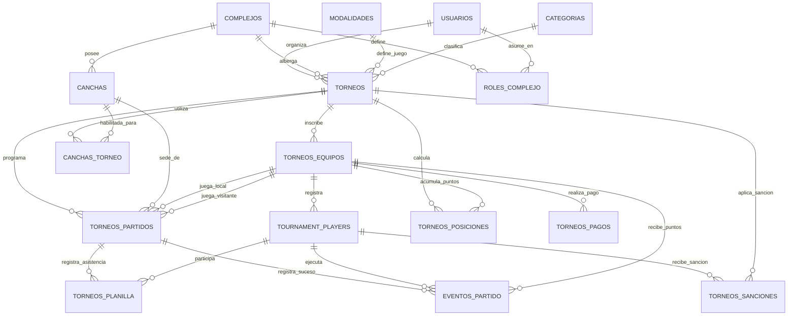

# 🏆 Modelo Entidad-Relación (MER) — Sistema de Gestión de Torneos Deportivos (Equipos por Torneo)
**DBA / Arquitecto de Software Senior — Antigravity**  
**Estándar:** 3ra Forma Normal (3NF) · PostgreSQL-compatible · Soporte Multitenant  

---

## 📐 Diagrama de Relaciones (Mermaid)

---

## 🗂️ CATÁLOGO DE TABLAS Y CAMPOS

### 1. `usuarios` (Global)
Gestiona el acceso de administradores, organizadores y veedores.

| Campo | Tipo | Nulos | Restricción | Descripción |
|---|---|---|---|---|
| `id` | `INTEGER` | NOT NULL | PRIMARY KEY | Identificador único |
| `nombre` | `VARCHAR(100)` | NOT NULL | — | Nombre del usuario |
| `apellido` | `VARCHAR(100)` | NOT NULL | — | Apellido del usuario |
| `email` | `VARCHAR(255)` | NOT NULL | UNIQUE | Correo electrónico de acceso |
| `password_hash` | `VARCHAR(255)` | NOT NULL | — | Hash de la contraseña |
| `activo` | `BOOLEAN` | NOT NULL | DEFAULT TRUE | Estado de la cuenta |

---

### 2. `complejos` (Tenants)
Cada predio o complejo deportivo que actúa como un "tenant" (multitenancy).

| Campo | Tipo | Nulos | Restricción | Descripción |
|---|---|---|---|---|
| `id` | `UUID` | NOT NULL | PRIMARY KEY | Identificador del complejo |
| `nombre` | `VARCHAR(200)` | NOT NULL | — | Nombre del complejo |
| `direccion` | `TEXT` | NOT NULL | — | Dirección del complejo |
| `activo` | `BOOLEAN` | NOT NULL | DEFAULT TRUE | Si está activo |

---

### 3. `roles_complejo` (Multitenancy)
Define qué rol tiene un usuario dentro de un complejo/tenant específico.

| Campo | Tipo | Nulos | Restricción | Descripción |
|---|---|---|---|---|
| `id` | `UUID` | NOT NULL | PRIMARY KEY | Identificador único |
| `complejo_id` | `UUID` | NOT NULL | FK → `complejos(id)` | Complejo/Tenant |
| `usuario_id` | `INTEGER` | NOT NULL | FK → `usuarios(id)` | Usuario |
| `rol` | `VARCHAR(30)` | NOT NULL | CHECK (rol IN ('admin_complejo', 'organizador', 'veedor')) | Rol específico |

---

### 4. `modalidades` (Lookup)
Formatos de juego soportados.

| Campo | Tipo | Nulos | Restricción | Descripción |
|---|---|---|---|---|
| `id` | `SMALLINT` | NOT NULL | PRIMARY KEY | Identificador autoincremental |
| `codigo` | `VARCHAR(30)` | NOT NULL | UNIQUE | Ej: `LIGA`, `PLAYOFF`, `MIXTO`, `SUIZO` |
| `nombre` | `VARCHAR(100)` | NOT NULL | — | Nombre legible |

---

### 5. `categorias` (Lookup)
Divisiones competitivas.

| Campo | Tipo | Nulos | Restricción | Descripción |
|---|---|---|---|---|
| `id` | `SMALLINT` | NOT NULL | PRIMARY KEY | Identificador autoincremental |
| `codigo` | `VARCHAR(30)` | NOT NULL | UNIQUE | Ej: `PRIMERA`, `SENIOR`, `FEMENINO` |
| `nombre` | `VARCHAR(100)` | NOT NULL | — | Nombre de la categoría |

---

### 6. `torneos`
Centraliza la información de un torneo asociado a un complejo (tenant).

| Campo | Tipo | Nulos | Restricción | Descripción |
|---|---|---|---|---|
| `id` | `UUID` | NOT NULL | PRIMARY KEY | Identificador único |
| `complejo_id` | `UUID` | NOT NULL | FK → `complejos(id)` | Tenant dueño del torneo |
| `modalidad_id` | `SMALLINT` | NOT NULL | FK → `modalidades(id)` | Sistema de juego |
| `categoria_id` | `SMALLINT` | NOT NULL | FK → `categorias(id)` | Categoría del torneo |
| `nombre` | `VARCHAR(200)` | NOT NULL | — | Nombre del torneo |
| `slug` | `VARCHAR(170)` | NOT NULL | UNIQUE | URL para acceso público |
| `estado` | `VARCHAR(30)` | NOT NULL | DEFAULT 'abierto' | `abierto`, `en_curso`, `finalizado` |

---

### 7. `torneos_equipos` (Equipos por Torneo)
**Nota de negocio:** Un equipo se registra por torneo. "Lazio" del Torneo A es una fila diferente de "Lazio" del Torneo B.

| Campo | Tipo | Nulos | Restricción | Descripción |
|---|---|---|---|---|
| `id` | `UUID` | NOT NULL | PRIMARY KEY | Identificador único |
| `torneo_id` | `UUID` | NOT NULL | FK → `torneos(id)` | Torneo en el que compite |
| `nombre` | `VARCHAR(150)` | NOT NULL | — | Nombre del equipo en este torneo |
| `logo_url` | `VARCHAR(500)` | NULL | — | Escudo del equipo para este torneo |
| `color_principal` | `CHAR(7)` | NULL | — | Color primario en este torneo |
| `color_secundario` | `CHAR(7)` | NULL | — | Color secundario en este torneo |

---

### 8. `tournament_players` (Jugadores por Equipo de Torneo)
Roster o lista de buena fe de jugadores inscritos para un equipo en un torneo específico.

| Campo | Tipo | Nulos | Restricción | Descripción |
|---|---|---|---|---|
| `id` | `UUID` | NOT NULL | PRIMARY KEY | Identificador único |
| `torneo_equipo_id` | `UUID` | NOT NULL | FK → `torneos_equipos(id)` | Equipo al que pertenece en el torneo |
| `nombre` | `VARCHAR(200)` | NOT NULL | — | Nombre del jugador |
| `dni` | `VARCHAR(20)` | NOT NULL | — | DNI (único por equipo en torneo) |
| `numero_camiseta` | `SMALLINT` | NULL | — | Número de camiseta asignada |
| `posicion` | `VARCHAR(40)` | NULL | — | Posición de juego |
| `face_encoding` | `JSONB` | NULL | — | Vector facial para acreditación |

---

### 9. `torneos_partidos`
Encuentros programados y disputados.

| Campo | Tipo | Nulos | Restricción | Descripción |
|---|---|---|---|---|
| `id` | `UUID` | NOT NULL | PRIMARY KEY | Identificador único |
| `torneo_id` | `UUID` | NOT NULL | FK → `torneos(id)` | Torneo del fixture |
| `cancha_id` | `UUID` | NULL | FK → `canchas(id)` | Cancha donde se juega |
| `equipo_local_id` | `UUID` | NOT NULL | FK → `torneos_equipos(id)` | Local |
| `equipo_visitante_id` | `UUID` | NOT NULL | FK → `torneos_equipos(id)` | Visitante |
| `goles_local` | `INTEGER` | NULL | — | Marcador local |
| `goles_visitante` | `INTEGER` | NULL | — | Marcador visitante |
| `jornada` | `SMALLINT` | NULL | — | Fecha numérica (ej: 1, 2, 3) |
| `estado` | `VARCHAR(30)` | NOT NULL | DEFAULT 'programado' | `programado`, `en_curso`, `finalizado` |

---

### 10. `eventos_partido` (Unificado)
Eventos cronometrados del partido (goles, tarjetas, sustituciones, etc.).

| Campo | Tipo | Nulos | Restricción | Descripción |
|---|---|---|---|---|
| `id` | `UUID` | NOT NULL | PRIMARY KEY | Identificador único |
| `partido_id` | `UUID` | NOT NULL | FK → `torneos_partidos(id)` | Partido |
| `player_id` | `UUID` | NULL | FK → `tournament_players(id)` | Jugador involucrado |
| `equipo_id` | `UUID` | NOT NULL | FK → `torneos_equipos(id)` | Equipo del evento |
| `tipo` | `VARCHAR(25)` | NOT NULL | — | `GOL`, `AUTOGOL`, `AMARILLA`, `ROJA` |
| `minuto` | `SMALLINT` | NOT NULL | — | Minuto del suceso |

---

## 📈 LÓGICA DE CARDINALIDAD E INTEGRIDAD
- **`torneos_equipos` y `tournament_players`** aseguran que los rosters y equipos estén perfectamente aislados. Si "Lazio" juega el Torneo Apertura y luego el Torneo Clausura, se registran como dos entidades diferentes de equipo en `torneos_equipos` (con IDs únicos).
- El **recalculador de posiciones** y la **planilla digital** apuntan directamente a estos IDs locales, eliminando la necesidad de manejar históricos de pases o resolver conflictos de nombres iguales de clubes entre torneos distintos.
