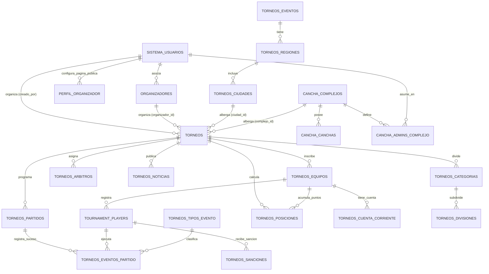
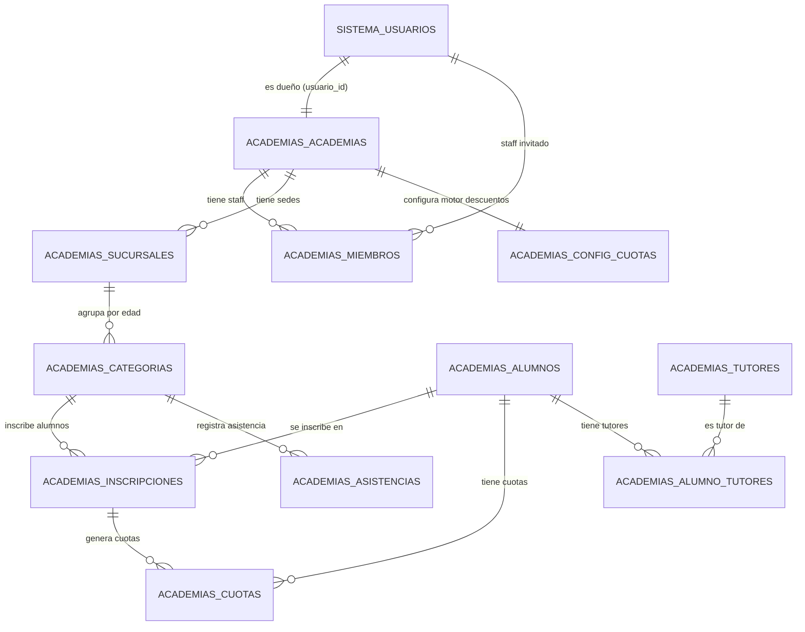

# 🏆 Modelo Entidad-Relación (MER) — Sistema Mi Cancha
**DBA / Arquitecto de Software Senior — Antigravity**  
**Estándar:** 3ra Forma Normal (3NF) · PostgreSQL-compatible · Soporte Multitenant  
**Actualizado:** 2026-07-20 — Post-Migración 039

---

## 🗂️ Schemas del Sistema

| Schema | Propósito |
|--------|-----------|
| `sistema` | Usuarios, roles, permisos, auditoría, notificaciones, perfil organizador |
| `cancha` | Complejos deportivos, canchas, reservas, clientes, pagos |
| `torneos` | Torneos de fútbol por equipo (LIGA, PLAYOFF, MIXTO) |
| `torneos_generales` | Torneos individuales (artes marciales, etc.) |
| `academias` | Sistema de academias deportivas (SAD-M) |

---

## 📐 Diagrama de Relaciones — Módulo Torneos Fútbol

---

## 📐 Diagrama de Relaciones — Módulo Academias

---

## 🗂️ CATÁLOGO DE TABLAS Y CAMPOS

---

### SCHEMA: `sistema`

### 1. `sistema.usuarios`
Gestiona el acceso de todos los tipos de usuario del sistema.

| Campo | Tipo | Nulos | Restricción | Descripción |
|---|---|---|---|---|
| `id` | `INTEGER` | NOT NULL | PRIMARY KEY | Identificador único |
| `username` | `VARCHAR(50)` | NOT NULL | UNIQUE | Nombre de usuario de acceso |
| `email` | `VARCHAR(100)` | NOT NULL | UNIQUE | Correo electrónico |
| `hashed_password` | `VARCHAR(255)` | NOT NULL | — | Hash bcrypt de la contraseña |
| `nombre_completo` | `VARCHAR(100)` | NOT NULL | — | Nombre del usuario |
| `rol` | `VARCHAR(20)` | NOT NULL | DEFAULT 'user' | `admin`, `complejo`, `organizador`, `veedor`, `delegado`, `jugador`, `academia` |
| `activo` | `BOOLEAN` | NOT NULL | DEFAULT TRUE | Estado de la cuenta |
| `fecha_creacion` | `DATETIME` | NOT NULL | DEFAULT now() | Fecha de registro |
| `ultimo_acceso` | `DATETIME` | NULL | — | Último inicio de sesión |
| `creado_por` | `INTEGER` | NULL | FK → `sistema.usuarios(id)` | Quién creó el usuario |

**Notas de roles:**
- `complejo` → dueño del complejo; contexto en `cancha.admins_complejo`
- `academia` → dueño de academia; contexto en `academias.academias`
- `administrador`, `tesorero`, `profesor` → roles internos de academia en `academias.miembros`

---

### 2. `sistema.perfil_organizador` 🆕 *Migración 031*
Página web pública configurable para cada organizador de torneos.

| Campo | Tipo | Nulos | Restricción | Descripción |
|---|---|---|---|---|
| `usuario_id` | `INTEGER` | NOT NULL | PRIMARY KEY, FK → `sistema.usuarios(id)` | Organizador dueño |
| `enlace_sitio` | `VARCHAR(100)` | NULL | UNIQUE | Slug URL pública (ej: `miliga2026`) |
| `logo_url` | `VARCHAR(255)` | NULL | — | URL del logo |
| `banner_url` | `VARCHAR(255)` | NULL | — | URL del banner principal |
| `color_primario` | `VARCHAR(20)` | NULL | DEFAULT `#1e3a8a` | Color institucional |
| `texto_1` | `VARCHAR(255)` | NULL | — | Título principal de la página |
| `texto_2` | `VARCHAR(255)` | NULL | — | Subtítulo / descripción |
| `visibilidad` | `VARCHAR(20)` | NULL | DEFAULT `publico` | `publico` / `privado` |
| `tipo_sede` | `VARCHAR(20)` | NULL | DEFAULT `fisico` | `fisico` / `virtual` |
| `acerca_de` | `TEXT` | NULL | — | Descripción larga |
| `idioma` | `VARCHAR(30)` | NULL | DEFAULT `Spanish` | Idioma de la página |
| `pais` | `VARCHAR(100)` | NULL | — | País |
| `departamento` | `VARCHAR(100)` | NULL | — | Departamento/Provincia |
| `ciudad` | `VARCHAR(100)` | NULL | — | Ciudad |
| `facebook` | `VARCHAR(200)` | NULL | — | URL de Facebook |
| `instagram` | `VARCHAR(200)` | NULL | — | URL de Instagram |
| `youtube` | `VARCHAR(200)` | NULL | — | URL de YouTube |
| `twitch` | `VARCHAR(200)` | NULL | — | URL de Twitch |
| `twitter` | `VARCHAR(200)` | NULL | — | URL de Twitter/X |
| `whatsapp` | `VARCHAR(50)` | NULL | — | Número de WhatsApp |
| `email` | `VARCHAR(100)` | NULL | — | Email de contacto público |
| `telefono` | `VARCHAR(50)` | NULL | — | Teléfono de contacto |
| `opcion_chat` | `BOOLEAN` | NULL | DEFAULT FALSE | Habilita chat en página |
| `opcion_publicidad` | `VARCHAR(30)` | NULL | DEFAULT `ninguno` | Tipo de publicidad habilitada |
| `posicion_banner` | `VARCHAR(50)` | NULL | DEFAULT `inferior_flotante` | Posición del banner |
| `actualizado_en` | `TIMESTAMPTZ` | NULL | DEFAULT now() | Última actualización |

**Endpoint público:** `GET /organizador/{slug}` → Página pública del organizador.

---

### SCHEMA: `cancha`

### 3. `cancha.complejos`
Cada predio o complejo deportivo que actúa como tenant.

| Campo | Tipo | Nulos | Restricción | Descripción |
|---|---|---|---|---|
| `id` | `UUID` | NOT NULL | PRIMARY KEY | Identificador del complejo |
| `nombre` | `VARCHAR(200)` | NOT NULL | — | Nombre del complejo |
| `descripcion` | `TEXT` | NULL | — | Descripción |
| `telefono` | `VARCHAR(50)` | NULL | — | Teléfono |
| `email` | `VARCHAR(100)` | NULL | — | Email |
| `direccion` | `TEXT` | NOT NULL | — | Dirección |
| `ciudad` | `VARCHAR(100)` | NULL | DEFAULT `Asunción` | Ciudad |
| `departamento` | `VARCHAR(100)` | NULL | DEFAULT `Central` | Departamento |
| `ubicacion` | `GEOGRAPHY(POINT,4326)` | NULL | — | Coordenadas PostGIS |
| `foto_portada` | `VARCHAR(500)` | NULL | — | Foto de portada |
| `fotos` | `TEXT[]` | NULL | — | Array de URLs de fotos |
| `horario_apertura` | `TIME` | NULL | DEFAULT `07:00` | Horario de apertura |
| `horario_cierre` | `TIME` | NULL | DEFAULT `23:00` | Horario de cierre |
| `dias_habilitados` | `TEXT[]` | NULL | — | Días de operación |
| `es_publico` | `BOOLEAN` | NOT NULL | DEFAULT FALSE | Visible en búsqueda pública |
| `configuracion` | `JSONB` | NULL | — | Config. avanzada |
| `activo` | `BOOLEAN` | NOT NULL | DEFAULT TRUE | Estado |
| `creado_en` | `TIMESTAMPTZ` | NOT NULL | DEFAULT now() | Fecha de creación |
| `actualizado_en` | `TIMESTAMPTZ` | NOT NULL | DEFAULT now() | Última actualización |

---

### 4. `cancha.admins_complejo`
Define qué rol tiene un usuario dentro de un complejo específico.

| Campo | Tipo | Nulos | Restricción | Descripción |
|---|---|---|---|---|
| `id` | `UUID` | NOT NULL | PRIMARY KEY | Identificador único |
| `complejo_id` | `UUID` | NOT NULL | FK → `cancha.complejos(id)` | Complejo/Tenant |
| `usuario_id` | `INTEGER` | NOT NULL | FK → `sistema.usuarios(id)` | Usuario del sistema |
| `rol` | `VARCHAR(50)` | NOT NULL | DEFAULT `admin` | `admin` / `operador` |
| `activo` | `BOOLEAN` | NOT NULL | DEFAULT TRUE | Si el acceso está vigente |
| `creado_en` | `TIMESTAMPTZ` | NOT NULL | DEFAULT now() | Fecha de asignación |

---

### 5. `cancha.canchas`

| Campo | Tipo | Nulos | Restricción | Descripción |
|---|---|---|---|---|
| `id` | `UUID` | NOT NULL | PRIMARY KEY | Identificador único |
| `complejo_id` | `UUID` | NOT NULL | FK → `cancha.complejos(id)` | Complejo al que pertenece |
| `nombre` | `VARCHAR(100)` | NOT NULL | — | Nombre (ej: "Cancha 1") |
| `deporte` | `VARCHAR(50)` | NOT NULL | — | Fútbol, Pádel, Tenis, etc. |
| `superficie` | `VARCHAR(50)` | NULL | — | Sintético, Arcilla, Cristal, etc. |
| `dimensiones` | `VARCHAR(50)` | NULL | — | "40x20m", "Fútbol 5", etc. |
| `capacidad_jugadores` | `INTEGER` | NULL | DEFAULT 10 | Jugadores por turno |
| `precio_hora` | `NUMERIC(12,0)` | NOT NULL | — | Precio en Guaraníes |
| `precio_hora_nocturna` | `NUMERIC(12,0)` | NULL | — | Precio nocturno diferenciado |
| `hora_inicio_nocturna` | `TIME` | NULL | DEFAULT `20:00` | Inicio de tarifa nocturna |
| `color` | `VARCHAR(20)` | NULL | DEFAULT `#3B82F6` | Color en el timeline |
| `activo` | `BOOLEAN` | NOT NULL | DEFAULT TRUE | Estado |
| `creado_en` | `TIMESTAMPTZ` | NOT NULL | DEFAULT now() | Fecha de creación |

---

### 6. `cancha.organizadores` 🆕 *Migración 009*
Organizadores independientes (sin complejo físico).

| Campo | Tipo | Nulos | Restricción | Descripción |
|---|---|---|---|---|
| `id` | `INTEGER` | NOT NULL | PRIMARY KEY | Identificador autoincremental |
| `usuario_id` | `INTEGER` | NOT NULL | UNIQUE, FK → `sistema.usuarios(id)` | Usuario del sistema |
| `nombre` | `VARCHAR(200)` | NOT NULL | — | Nombre del organizador/evento |
| `tipo_torneo` | `VARCHAR(50)` | NULL | DEFAULT `futbol` | Deporte que organiza (*Migración 017*) |
| `plan` | `VARCHAR(30)` | NOT NULL | DEFAULT `basico` | Plan contratado |
| `max_torneos` | `SMALLINT` | NOT NULL | DEFAULT 3 | Máx. torneos permitidos |
| `habilitado` | `BOOLEAN` | NOT NULL | DEFAULT TRUE | Si está habilitado |
| `creado_en` | `TIMESTAMPTZ` | NOT NULL | DEFAULT now() | Fecha de registro |

---

### 7. `cancha.cuenta_corriente_equipos` 🆕 *Migración 012*

| Campo | Tipo | Nulos | Restricción | Descripción |
|---|---|---|---|---|
| `id` | `UUID` | NOT NULL | PRIMARY KEY | Identificador único |
| `torneo_id` | `UUID` | NOT NULL | FK → `torneos.torneos(id)` | Torneo relacionado |
| `equipo_id` | `UUID` | NOT NULL | FK → `torneos.equipos(id)` | Equipo en cuestión |
| `concepto` | `VARCHAR(100)` | NOT NULL | — | Detalle del cargo/pago |
| `monto` | `NUMERIC(12,2)` | NOT NULL | — | Monto en Gs |
| `estado` | `VARCHAR(20)` | NOT NULL | DEFAULT `pendiente` | `pendiente`, `pagado` |
| `partido_id` | `UUID` | NULL | FK → `torneos.partidos(id)` | Partido origen (opcional) |
| `creado_en` | `TIMESTAMPTZ` | NOT NULL | DEFAULT now() | Fecha de registro |

---

### SCHEMA: `torneos`

### 8. `torneos.torneos`

| Campo | Tipo | Nulos | Restricción | Descripción |
|---|---|---|---|---|
| `id` | `UUID` | NOT NULL | PRIMARY KEY | Identificador único |
| `complejo_id` | `UUID` | NULL | FK → `cancha.complejos(id)` | Tenant dueño (opcional) |
| `organizador_id` | `INTEGER` | NULL | FK → `cancha.organizadores(id)` | Organizador independiente |
| `ciudad_id` | `UUID` | NULL | FK → `torneos.ciudades(id)` | Ciudad del campeonato |
| `tipo_campeonato` | `VARCHAR(50)` | NULL | DEFAULT `categorias` | Tipo de fixture (*Mig 031*) |
| `creado_por` | `INTEGER` | NULL | FK → `sistema.usuarios(id)` | Usuario creador |
| `nombre` | `VARCHAR(200)` | NOT NULL | — | Nombre del torneo |
| `slug` | `VARCHAR(170)` | NULL | UNIQUE | URL pública |
| `estado` | `VARCHAR(30)` | NOT NULL | DEFAULT `abierto` | `abierto`, `en_curso`, `finalizado` |
| `puntos_victoria` | `SMALLINT` | NOT NULL | DEFAULT 3 | Pts por victoria |
| `puntos_empate` | `SMALLINT` | NOT NULL | DEFAULT 1 | Pts por empate |
| `puntos_derrota` | `SMALLINT` | NOT NULL | DEFAULT 0 | Pts por derrota |
| `max_equipos` | `INTEGER` | NOT NULL | DEFAULT 16 | Cupo máximo de equipos |
| `costo_inscripcion` | `NUMERIC` | NOT NULL | DEFAULT 0 | Arancel de inscripción |
| `es_publico` | `BOOLEAN` | NOT NULL | DEFAULT TRUE | Landing pública habilitada |
| `limite_deuda_habilitado` | `BOOLEAN` | NOT NULL | DEFAULT FALSE | Bloqueo por deuda |
| `limite_deuda_monto` | `NUMERIC` | NULL | DEFAULT 0 | Monto límite de bloqueo |
| `multa_amarilla_monto` | `NUMERIC` | NULL | DEFAULT 0 | Monto multa amarilla |
| `multa_roja_monto` | `NUMERIC` | NULL | DEFAULT 0 | Monto multa roja |
| `banner_url` | `VARCHAR(500)` | NULL | — | Banner del torneo |

---

### 9. `torneos.categorias` 🆕 *Migración 031*
Categorías dentro de un torneo (ej: Femenino, Masculino, Sub-15).

| Campo | Tipo | Nulos | Restricción | Descripción |
|---|---|---|---|---|
| `id` | `UUID` | NOT NULL | PRIMARY KEY | Identificador único |
| `torneo_id` | `UUID` | NOT NULL | FK → `torneos.torneos(id)` | Torneo al que pertenece |
| `nombre` | `VARCHAR(100)` | NOT NULL | — | Nombre de la categoría |
| `descripcion` | `TEXT` | NULL | — | Descripción |
| `pts_victoria` | `INTEGER` | NULL | DEFAULT 3 | Pts victoria |
| `pts_empate` | `INTEGER` | NULL | DEFAULT 1 | Pts empate |
| `pts_derrota` | `INTEGER` | NULL | DEFAULT 0 | Pts derrota |
| `criterio_desempate` | `VARCHAR(100)` | NULL | — | Criterio de desempate |
| `creado_en` | `TIMESTAMPTZ` | NOT NULL | DEFAULT now() | Fecha de creación |

---

### 10. `torneos.divisiones` 🆕 *Migración 031*
Subdivisiones dentro de una categoría (ej: Primera A, Primera B).

| Campo | Tipo | Nulos | Restricción | Descripción |
|---|---|---|---|---|
| `id` | `UUID` | NOT NULL | PRIMARY KEY | Identificador único |
| `categoria_id` | `UUID` | NOT NULL | FK → `torneos.categorias(id)` | Categoría padre |
| `nombre` | `VARCHAR(100)` | NOT NULL | — | Nombre de la división |
| `creado_en` | `TIMESTAMPTZ` | NOT NULL | DEFAULT now() | Fecha de creación |

---

### 11. `torneos.equipos` (antes `torneos_equipos`)
Un equipo se registra por torneo de forma independiente.

| Campo | Tipo | Nulos | Restricción | Descripción |
|---|---|---|---|---|
| `id` | `UUID` | NOT NULL | PRIMARY KEY | Identificador único |
| `torneo_id` | `UUID` | NOT NULL | FK → `torneos.torneos(id)` | Torneo en el que compite |
| `division_id` | `UUID` | NULL | FK → `torneos.divisiones(id)` | División asignada |
| `nombre` | `VARCHAR(150)` | NOT NULL | — | Nombre del equipo |
| `logo_url` | `VARCHAR(500)` | NULL | — | Escudo del equipo |
| `color_principal` | `CHAR(7)` | NULL | — | Color primario |
| `color_secundario` | `CHAR(7)` | NULL | — | Color secundario |
| `estado_inscripcion` | `VARCHAR(20)` | NOT NULL | DEFAULT `pendiente` | `pendiente`, `confirmado`, `descalificado` |

---

### 12. `torneos.tournament_players`

| Campo | Tipo | Nulos | Restricción | Descripción |
|---|---|---|---|---|
| `id` | `UUID` | NOT NULL | PRIMARY KEY | Identificador único |
| `torneo_equipo_id` | `UUID` | NOT NULL | FK → `torneos.equipos(id)` | Equipo al que pertenece |
| `nombre` | `VARCHAR(200)` | NOT NULL | — | Nombre del jugador |
| `dni` | `VARCHAR(20)` | NOT NULL | — | DNI (único por equipo) |
| `numero_camiseta` | `SMALLINT` | NULL | — | Número de camiseta |
| `posicion` | `VARCHAR(40)` | NULL | — | Posición de juego |
| `face_encoding` | `JSONB` | NULL | — | Vector facial para acreditación |
| `biometria_aprobada` | `BOOLEAN` | NULL | DEFAULT FALSE | Biometría validada |
| `biometria_hash` | `VARCHAR(255)` | NULL | — | Hash biométrico |
| `estado` | `VARCHAR(20)` | NOT NULL | DEFAULT `habilitado` | `habilitado`, `suspendido`, `inhabilitado` |

---

### 13. `torneos.equipo_tecnico` 🆕 *Migración 031*

| Campo | Tipo | Nulos | Restricción | Descripción |
|---|---|---|---|---|
| `id` | `UUID` | NOT NULL | PRIMARY KEY | Identificador único |
| `equipo_id` | `UUID` | NOT NULL | FK → `torneos.equipos(id)` | Equipo al que pertenece |
| `nombre` | `VARCHAR(150)` | NOT NULL | — | Nombre |
| `dni` | `VARCHAR(50)` | NULL | — | Documento de identidad |
| `rol` | `VARCHAR(50)` | NULL | DEFAULT `Entrenador` | Rol en el cuerpo técnico |
| `foto_url` | `VARCHAR(255)` | NULL | — | Foto |
| `biometria_aprobada` | `BOOLEAN` | NULL | DEFAULT FALSE | Biometría validada |
| `creado_en` | `TIMESTAMPTZ` | NOT NULL | DEFAULT now() | Fecha de creación |

---

### 14. `torneos.partidos` (antes `torneos_partidos`)

| Campo | Tipo | Nulos | Restricción | Descripción |
|---|---|---|---|---|
| `id` | `UUID` | NOT NULL | PRIMARY KEY | Identificador único |
| `torneo_id` | `UUID` | NOT NULL | FK → `torneos.torneos(id)` | Torneo del fixture |
| `cancha_id` | `UUID` | NULL | FK → `cancha.canchas(id)` | Cancha donde se juega |
| `arbitro_id` | `UUID` | NULL | FK → `torneos.arbitros(id)` | Árbitro asignado |
| `equipo_local_id` | `UUID` | NOT NULL | FK → `torneos.equipos(id)` | Local |
| `equipo_visitante_id` | `UUID` | NOT NULL | FK → `torneos.equipos(id)` | Visitante |
| `fecha_hora` | `TIMESTAMPTZ` | NULL | — | Fecha y hora programada |
| `goles_local` | `INTEGER` | NULL | — | Marcador local |
| `goles_visitante` | `INTEGER` | NULL | — | Marcador visitante |
| `jornada` | `SMALLINT` | NULL | — | Número de jornada |
| `fase` | `VARCHAR(60)` | NULL | — | Nombre de la fase/ronda |
| `estado` | `VARCHAR(30)` | NOT NULL | DEFAULT `programado` | `programado`, `en_curso`, `finalizado`, `wo` |

---

### 15. `torneos.tipos_evento` 🆕 *Migración 008*

| Campo | Tipo | Nulos | Restricción | Descripción |
|---|---|---|---|---|
| `id` | `SMALLINT` | NOT NULL | PRIMARY KEY | Identificador |
| `codigo` | `VARCHAR(30)` | NOT NULL | UNIQUE | `GOL`, `AMARILLA`, `ROJA`, `SUSTITUCION`... |
| `nombre` | `VARCHAR(100)` | NOT NULL | — | Nombre legible |
| `aplica_a` | `VARCHAR(20)` | NOT NULL | CHECK IN ('jugador','equipo','partido') | A quién aplica |
| `afecta_marcador` | `BOOLEAN` | NOT NULL | DEFAULT FALSE | Modifica el score |
| `afecta_disciplina` | `BOOLEAN` | NOT NULL | DEFAULT FALSE | Genera sanción |
| `activo` | `BOOLEAN` | NOT NULL | DEFAULT TRUE | Habilitado |

**Valores pre-cargados:** `GOL`, `GOL_PENAL`, `AUTOGOL`, `AMARILLA`, `ROJA`, `ROJA_DIRECTA`, `DOBLE_AMARILLA`, `SUSTITUCION`, `LESION`, `TIEMPO_EXTRA`, `PENALES`, `PENAL_CONVERTIDO`, `PENAL_ERRADO`

---

### 16. `torneos.eventos_partido` (Unificado)

| Campo | Tipo | Nulos | Restricción | Descripción |
|---|---|---|---|---|
| `id` | `UUID` | NOT NULL | PRIMARY KEY | Identificador único |
| `partido_id` | `UUID` | NOT NULL | FK → `torneos.partidos(id)` | Partido |
| `tipo_evento_id` | `SMALLINT` | NULL | FK → `torneos.tipos_evento(id)` | Tipo del evento |
| `player_id` | `UUID` | NULL | FK → `torneos.tournament_players(id)` | Jugador (en SUSTITUCIÓN: el que **entra**) |
| `player_out_id` | `UUID` | NULL | FK → `torneos.tournament_players(id)` | En SUSTITUCIÓN: el que **sale** |
| `equipo_id` | `UUID` | NOT NULL | FK → `torneos.equipos(id)` | Equipo del evento |
| `tipo` | `VARCHAR(25)` | NOT NULL | — | Código del tipo |
| `minuto` | `SMALLINT` | NOT NULL | CHECK >= 0 AND <= 150 | Minuto del suceso |
| `periodo` | `SMALLINT` | NOT NULL | DEFAULT 1 | Primer o segundo tiempo |
| `es_tiempo_adicional` | `BOOLEAN` | NOT NULL | DEFAULT FALSE | Si ocurrió en tiempo adicional |
| `observaciones` | `TEXT` | NULL | — | Notas del veedor |

---

### 17. `torneos.posiciones`

| Campo | Tipo | Nulos | Restricción | Descripción |
|---|---|---|---|---|
| `id` | `UUID` | NOT NULL | PRIMARY KEY | Identificador único |
| `torneo_id` | `UUID` | NOT NULL | FK → `torneos.torneos(id)` | Torneo |
| `equipo_id` | `UUID` | NOT NULL | FK → `torneos.equipos(id)` | Equipo |
| `puntos` | `INTEGER` | NOT NULL | DEFAULT 0 | Puntos acumulados |
| `partidos_jugados` | `INTEGER` | NOT NULL | DEFAULT 0 | PJ |
| `partidos_ganados` | `INTEGER` | NOT NULL | DEFAULT 0 | PG |
| `partidos_empatados` | `INTEGER` | NOT NULL | DEFAULT 0 | PE |
| `partidos_perdidos` | `INTEGER` | NOT NULL | DEFAULT 0 | PP |
| `goles_favor` | `INTEGER` | NOT NULL | DEFAULT 0 | GF |
| `goles_contra` | `INTEGER` | NOT NULL | DEFAULT 0 | GC |
| `diferencia_goles` | `INTEGER` | NOT NULL | DEFAULT 0 | DG |
| `actualizado_en` | `TIMESTAMPTZ` | NOT NULL | DEFAULT now() | Última actualización |

---

### 18. `torneos.sanciones`

| Campo | Tipo | Nulos | Restricción | Descripción |
|---|---|---|---|---|
| `id` | `UUID` | NOT NULL | PRIMARY KEY | Identificador único |
| `torneo_id` | `UUID` | NOT NULL | FK → `torneos.torneos(id)` | Torneo |
| `player_id` | `UUID` | NOT NULL | FK → `torneos.tournament_players(id)` | Jugador sancionado |
| `tipo` | `VARCHAR(50)` | NOT NULL | — | Tipo de sanción |
| `partidos_suspendido` | `INTEGER` | NOT NULL | DEFAULT 1 | Partidos de suspensión |
| `estado` | `VARCHAR(30)` | NOT NULL | DEFAULT `activa` | `activa`, `cumplida`, `levantada_por_pago` |
| `monto_multa` | `NUMERIC(12,2)` | NULL | — | Monto de multa asociada |
| `creado_en` | `TIMESTAMPTZ` | NOT NULL | DEFAULT now() | Fecha de aplicación |

---

### 19. `torneos.arbitros` 🆕 *Migración 036*

| Campo | Tipo | Nulos | Restricción | Descripción |
|---|---|---|---|---|
| `id` | `UUID` | NOT NULL | PRIMARY KEY | Identificador único |
| `torneo_id` | `UUID` | NOT NULL | FK → `torneos.torneos(id)` | Torneo al que pertenece |
| `nombre` | `VARCHAR(100)` | NOT NULL | — | Nombre del árbitro |
| `dni` | `VARCHAR(50)` | NULL | — | DNI |
| `rol` | `VARCHAR(50)` | NULL | — | `Arbitro Principal`, `Juez`, `Veedor` |
| `creado_en` | `TIMESTAMPTZ` | NOT NULL | DEFAULT now() | Fecha de registro |

---

### 20. `torneos.noticias_torneo` 🆕 *Migración 013*

| Campo | Tipo | Nulos | Restricción | Descripción |
|---|---|---|---|---|
| `id` | `UUID` | NOT NULL | PRIMARY KEY | Identificador único |
| `torneo_id` | `UUID` | NOT NULL | FK → `torneos.torneos(id)` | Torneo |
| `titulo` | `VARCHAR(255)` | NOT NULL | — | Título de la noticia |
| `contenido` | `TEXT` | NOT NULL | — | Cuerpo de la noticia |
| `autor` | `VARCHAR(100)` | NULL | — | Autor |
| `es_ia` | `BOOLEAN` | NOT NULL | DEFAULT FALSE | Generada por IA (Gemini) |
| `prompt_usado` | `TEXT` | NULL | — | Prompt original de IA |
| `fecha_publicacion` | `TIMESTAMPTZ` | NOT NULL | DEFAULT now() | Fecha de publicación |

---

### 21. `torneos.regiones` 🆕 *Migración 032*

| Campo | Tipo | Nulos | Restricción | Descripción |
|---|---|---|---|---|
| `id` | `UUID` | NOT NULL | PRIMARY KEY | Identificador único |
| `evento_id` | `UUID` | NOT NULL | FK → `torneos.eventos(id)` | Evento Global Padre |
| `nombre` | `VARCHAR(150)` | NOT NULL | — | Nombre de la región |
| `determinar_campeon_regional` | `BOOLEAN` | NOT NULL | DEFAULT FALSE | Habilita Playoff Regional |
| `creado_en` | `TIMESTAMPTZ` | NOT NULL | DEFAULT now() | Fecha de creación |

---

### 22. `torneos.ciudades` 🆕 *Migración 032*

| Campo | Tipo | Nulos | Restricción | Descripción |
|---|---|---|---|---|
| `id` | `UUID` | NOT NULL | PRIMARY KEY | Identificador único |
| `region_id` | `UUID` | NOT NULL | FK → `torneos.regiones(id)` | Región a la que pertenece |
| `nombre` | `VARCHAR(150)` | NOT NULL | — | Nombre de la ciudad |
| `creado_en` | `TIMESTAMPTZ` | NOT NULL | DEFAULT now() | Fecha de creación |

---

### SCHEMA: `torneos_generales` — Módulo Artes Marciales

### 23. `torneos_generales.categorias_marciales` 🆕 *Migración 030*

| Campo | Tipo | Nulos | Restricción | Descripción |
|---|---|---|---|---|
| `id` | `UUID` | NOT NULL | PRIMARY KEY | Identificador único |
| `torneo_id` | `UUID` | NOT NULL | FK → `torneos_generales.torneos(id)` | Torneo marcial |
| `nombre` | `VARCHAR(255)` | NOT NULL | — | Nombre de la categoría |
| `modalidad` | `VARCHAR(50)` | NOT NULL | — | `combate` / `formas` |
| `edad_min` / `edad_max` | `INTEGER` | NULL | — | Rango de edad |
| `cinturon_min` / `cinturon_max` | `VARCHAR(50)` | NULL | — | Rango de cinturones |
| `peso_min` / `peso_max` | `DECIMAL(5,2)` | NULL | — | Rango de peso en kg |
| `genero` | `VARCHAR(20)` | NULL | — | `M`, `F`, `Mixto` |

---

### 24. `torneos_generales.asam_combates` 🆕 *Migración 030*
Sistema de puntuación ASAM (Karate Combate).

| Campo | Tipo | Nulos | Restricción | Descripción |
|---|---|---|---|---|
| `id` | `UUID` | NOT NULL | PRIMARY KEY | Identificador único |
| `encuentro_id` | `UUID` | NOT NULL | FK → encuentros | Encuentro |
| `blanco_id` / `rojo_id` | `UUID` | NULL | FK → participantes | Competidores |
| `puntos_blanco` / `puntos_rojo` | `INT` | NULL | DEFAULT 0 | Puntos acumulados |
| `salidas_blanco` / `salidas_rojo` | `INT` | NULL | DEFAULT 0 | Salidas de área |
| `faltas_blanco` / `faltas_rojo` | `INT` | NULL | DEFAULT 0 | Faltas cometidas |
| `ganador_id` | `UUID` | NULL | FK → participantes | Ganador del combate |
| `metodo_victoria` | `VARCHAR(100)` | NULL | — | `puntos`, `hantei`, `descalificacion` |
| `estado` | `VARCHAR(50)` | NULL | DEFAULT `pendiente` | Estado del combate |
| `tiempo_restante_segundos` | `INT` | NULL | DEFAULT 90 | Tiempo (1:30 min) |

---

### 25. `torneos_generales.asam_formas` 🆕 *Migración 030*
Sistema ASAM Kata — puntaje con 5 jueces, descartando el mayor y el menor.

| Campo | Tipo | Nulos | Restricción | Descripción |
|---|---|---|---|---|
| `id` | `UUID` | NOT NULL | PRIMARY KEY | Identificador único |
| `categoria_id` | `UUID` | NOT NULL | FK → categorias_marciales | Categoría |
| `participante_id` | `UUID` | NOT NULL | FK → participantes | Competidor |
| `juez_1` ... `juez_5` | `DECIMAL(3,1)` | NULL | — | Puntajes individuales |
| `puntaje_descartado_alto` | `DECIMAL(3,1)` | NULL | — | Mayor puntaje descartado |
| `puntaje_descartado_bajo` | `DECIMAL(3,1)` | NULL | — | Menor puntaje descartado |
| `puntaje_final` | `DECIMAL(4,1)` | NULL | — | Puntaje final calculado |
| `posicion_final` | `INT` | NULL | — | Posición en el ranking |
| `estado` | `VARCHAR(50)` | NULL | DEFAULT `evaluando` | Estado |

---

### 26. `torneos_generales.pkf_combates` 🆕 *Migración 039*
Sistema PKF Kumite (formato olímpico WKF).

| Campo | Tipo | Nulos | Restricción | Descripción |
|---|---|---|---|---|
| `id` | `UUID` | NOT NULL | PRIMARY KEY | Identificador único |
| `encuentro_id` | `UUID` | NOT NULL | FK → encuentros | Encuentro |
| `aka_id` / `ao_id` | `UUID` | NULL | FK → participantes | Competidores (Rojo/Azul) |
| `puntos_aka` / `puntos_ao` | `INT` | NULL | DEFAULT 0 | Puntos |
| `senshu_aka` / `senshu_ao` | `BOOLEAN` | NULL | DEFAULT FALSE | Ventaja técnica (Senshu) |
| `jogai_aka` / `jogai_ao` | `INT` | NULL | DEFAULT 0 | Salidas de área |
| `video_review_aka` / `video_review_ao` | `VARCHAR(20)` | NULL | DEFAULT `ACTIVE` | Estado video review |
| `penalizaciones_aka` / `penalizaciones_ao` | `INT` | NULL | DEFAULT 0 | Penalizaciones |
| `ganador_id` | `UUID` | NULL | FK → participantes | Ganador |
| `metodo_victoria` | `VARCHAR(100)` | NULL | — | Método de victoria |
| `estado` | `VARCHAR(50)` | NULL | DEFAULT `pendiente` | Estado |
| `tiempo_restante_segundos` | `INT` | NULL | DEFAULT 90 | Tiempo restante |

---

### 27. `torneos_generales.pkf_formas_enfrentamientos` 🆕 *Migración 039*
Sistema PKF Kata — votación por banderas con 7 jueces.

| Campo | Tipo | Nulos | Restricción | Descripción |
|---|---|---|---|---|
| `id` | `UUID` | NOT NULL | PRIMARY KEY | Identificador único |
| `encuentro_id` | `UUID` | NOT NULL | FK → encuentros | Encuentro |
| `aka_id` / `ao_id` | `UUID` | NULL | FK → participantes | Competidores |
| `votos_aka` / `votos_ao` | `INT` | NULL | DEFAULT 0 | Votos de banderas |
| `juez_1_voto` ... `juez_7_voto` | `VARCHAR(20)` | NULL | — | Voto individual de cada juez |
| `ganador_id` | `UUID` | NULL | FK → participantes | Ganador por mayoría |
| `estado` | `VARCHAR(50)` | NULL | DEFAULT `evaluando` | Estado |

---

### SCHEMA: `academias` — Sistema SAD-M 🆕 *Migración 038*

### 28. `academias.academias` — Tenant Principal

| Campo | Tipo | Nulos | Restricción | Descripción |
|---|---|---|---|---|
| `id` | `UUID` | NOT NULL | PRIMARY KEY | Identificador único |
| `usuario_id` | `INTEGER` | NOT NULL | UNIQUE, FK → `sistema.usuarios(id)` | Dueño (`rol='academia'`) |
| `nombre` | `VARCHAR(200)` | NOT NULL | — | Nombre de la academia |
| `descripcion` | `TEXT` | NULL | — | Descripción breve |
| `logo_url` | `VARCHAR(500)` | NULL | — | URL del logo |
| `banner_url` | `VARCHAR(500)` | NULL | — | URL del banner |
| `color_primario` | `VARCHAR(20)` | NULL | DEFAULT `#1e3a8a` | Color institucional |
| `enlace_sitio` | `VARCHAR(100)` | NULL | UNIQUE | **Slug URL pública** (ej: `academiafc`) |
| `facebook` | `VARCHAR(200)` | NULL | — | URL de Facebook |
| `instagram` | `VARCHAR(200)` | NULL | — | URL de Instagram |
| `youtube` | `VARCHAR(200)` | NULL | — | URL de YouTube |
| `whatsapp` | `VARCHAR(50)` | NULL | — | Número de WhatsApp |
| `email` | `VARCHAR(100)` | NULL | — | Email de contacto público |
| `telefono` | `VARCHAR(50)` | NULL | — | Teléfono de contacto |
| `pais` | `VARCHAR(100)` | NULL | — | País |
| `departamento` | `VARCHAR(100)` | NULL | — | Departamento/Provincia |
| `ciudad` | `VARCHAR(100)` | NULL | — | Ciudad |
| `acerca_de` | `TEXT` | NULL | — | Descripción larga para página pública |
| `plan` | `VARCHAR(30)` | NOT NULL | CHECK IN ('basico','profesional','premium') | Plan de suscripción |
| `habilitada` | `BOOLEAN` | NOT NULL | DEFAULT TRUE | Si está activa |
| `creado_en` | `TIMESTAMPTZ` | NOT NULL | DEFAULT now() | Fecha de creación |
| `actualizado_en` | `TIMESTAMPTZ` | NOT NULL | DEFAULT now() | Última actualización |

**Endpoint público:** `GET /academia/{enlace_sitio}` → Página pública de la academia.

---

### 29. `academias.sucursales`

| Campo | Tipo | Nulos | Restricción | Descripción |
|---|---|---|---|---|
| `id` | `UUID` | NOT NULL | PRIMARY KEY | Identificador único |
| `academia_id` | `UUID` | NOT NULL | FK → `academias.academias(id)` | Academia dueña |
| `nombre` | `VARCHAR(200)` | NOT NULL | — | Nombre de la sucursal |
| `deporte` | `VARCHAR(50)` | NOT NULL | — | Deporte principal |
| `direccion` | `TEXT` | NULL | — | Dirección |
| `ciudad` | `VARCHAR(100)` | NULL | — | Ciudad |
| `departamento` | `VARCHAR(100)` | NULL | — | Departamento |
| `ubicacion` | `GEOGRAPHY(POINT,4326)` | NULL | — | Coordenadas PostGIS |
| `telefono` | `VARCHAR(50)` | NULL | — | Teléfono |
| `email` | `VARCHAR(100)` | NULL | — | Email |
| `activa` | `BOOLEAN` | NOT NULL | DEFAULT TRUE | Si está activa |
| `creado_en` | `TIMESTAMPTZ` | NOT NULL | DEFAULT now() | Fecha de creación |

---

### 30. `academias.miembros`
Staff invitado de la academia. El dueño **no** aparece aquí.

| Campo | Tipo | Nulos | Restricción | Descripción |
|---|---|---|---|---|
| `id` | `UUID` | NOT NULL | PRIMARY KEY | Identificador único |
| `academia_id` | `UUID` | NOT NULL | FK → `academias.academias(id)` | Academia |
| `usuario_id` | `INTEGER` | NOT NULL | FK → `sistema.usuarios(id)` | Usuario del sistema |
| `rol` | `VARCHAR(30)` | NOT NULL | CHECK IN ('administrador','tesorero','profesor') | Rol interno |
| `sucursal_id` | `UUID` | NULL | FK → `academias.sucursales(id)` | Sucursal asignada (NULL = total) |
| `activo` | `BOOLEAN` | NOT NULL | DEFAULT TRUE | Si el acceso está vigente |
| `creado_en` | `TIMESTAMPTZ` | NOT NULL | DEFAULT now() | Fecha de asignación |

**Roles internos:**
- `administrador` → Gestión administrativa completa (horarios, pagos, inscripciones, alumnos)
- `tesorero` → Solo módulo financiero (cuotas, pagos)
- `profesor` → Solo sus categorías/alumnos (restringido por `sucursal_id`)

---

### 31. `academias.alumnos`

| Campo | Tipo | Nulos | Restricción | Descripción |
|---|---|---|---|---|
| `id` | `UUID` | NOT NULL | PRIMARY KEY | Identificador único |
| `academia_id` | `UUID` | NOT NULL | FK → `academias.academias(id)` | Academia |
| `sucursal_id` | `UUID` | NULL | FK → `academias.sucursales(id)` | Sucursal principal |
| `nombre` | `VARCHAR(150)` | NOT NULL | — | Nombre |
| `apellido` | `VARCHAR(150)` | NULL | — | Apellido |
| `fecha_nacimiento` | `DATE` | NULL | — | Fecha de nacimiento (cálculo automático de categoría) |
| `foto_perfil` | `VARCHAR(500)` | NULL | — | Foto de perfil |
| `tipo_sangre` | `VARCHAR(10)` | NULL | — | Tipo de sangre |
| `alergias` | `TEXT` | NULL | — | Alergias declaradas |
| `condiciones_medicas` | `TEXT` | NULL | — | Condiciones crónicas |
| `seguro_medico` | `VARCHAR(200)` | NULL | — | Seguro médico |
| `contacto_emergencia` | `VARCHAR(200)` | NULL | — | Contacto de emergencia |
| `estado` | `VARCHAR(30)` | NOT NULL | CHECK IN ('activo','inactivo','prueba') | Estado |
| `notas` | `TEXT` | NULL | — | Observaciones |
| `creado_en` | `TIMESTAMPTZ` | NOT NULL | DEFAULT now() | Fecha de alta |
| `actualizado_en` | `TIMESTAMPTZ` | NOT NULL | DEFAULT now() | Última actualización |

---

### 32. `academias.tutores`

| Campo | Tipo | Nulos | Restricción | Descripción |
|---|---|---|---|---|
| `id` | `UUID` | NOT NULL | PRIMARY KEY | Identificador único |
| `academia_id` | `UUID` | NOT NULL | FK → `academias.academias(id)` | Academia |
| `nombre` | `VARCHAR(150)` | NOT NULL | — | Nombre del tutor |
| `apellido` | `VARCHAR(150)` | NULL | — | Apellido |
| `telefono` | `VARCHAR(50)` | NULL | — | Teléfono |
| `email` | `VARCHAR(100)` | NULL | — | Email (para notificaciones de cobro) |
| `vinculo` | `VARCHAR(50)` | NULL | — | Relación parental |
| `es_pagador` | `BOOLEAN` | NOT NULL | DEFAULT TRUE | Responsable del pago |
| `creado_en` | `TIMESTAMPTZ` | NOT NULL | DEFAULT now() | Fecha de alta |

---

### 33. `academias.alumno_tutores` (N:M)

| Campo | Tipo | Nulos | Restricción | Descripción |
|---|---|---|---|---|
| `alumno_id` | `UUID` | NOT NULL | PK, FK → `academias.alumnos(id)` | Alumno |
| `tutor_id` | `UUID` | NOT NULL | PK, FK → `academias.tutores(id)` | Tutor |
| `es_tutor_principal` | `BOOLEAN` | NOT NULL | DEFAULT FALSE | Si es el tutor principal de cobro |

---

### 34. `academias.categorias`

| Campo | Tipo | Nulos | Restricción | Descripción |
|---|---|---|---|---|
| `id` | `UUID` | NOT NULL | PRIMARY KEY | Identificador único |
| `sucursal_id` | `UUID` | NOT NULL | FK → `academias.sucursales(id)` | Sucursal |
| `nombre` | `VARCHAR(100)` | NOT NULL | — | Nombre (ej: "Sub-8", "Sub-15") |
| `edad_min` / `edad_max` | `SMALLINT` | NULL | — | Rango de edad habilitado |
| `descripcion` | `TEXT` | NULL | — | Descripción |
| `color` | `VARCHAR(20)` | NOT NULL | DEFAULT `#3B82F6` | Color identificatorio |
| `activa` | `BOOLEAN` | NOT NULL | DEFAULT TRUE | Si está activa |
| `creado_en` | `TIMESTAMPTZ` | NOT NULL | DEFAULT now() | Fecha de creación |

---

### 35. `academias.inscripciones`

| Campo | Tipo | Nulos | Restricción | Descripción |
|---|---|---|---|---|
| `id` | `UUID` | NOT NULL | PRIMARY KEY | Identificador único |
| `alumno_id` | `UUID` | NOT NULL | FK → `academias.alumnos(id)` | Alumno inscrito |
| `categoria_id` | `UUID` | NOT NULL | FK → `academias.categorias(id)` | Categoría |
| `fecha_inicio` | `DATE` | NOT NULL | — | Fecha de inicio |
| `fecha_fin` | `DATE` | NULL | — | Fecha de fin (NULL = sin vencimiento) |
| `dias_por_semana` | `SMALLINT` | NOT NULL | DEFAULT 3, BETWEEN 1 AND 7 | Frecuencia semanal |
| `cuota_mensual` | `NUMERIC(12,0)` | NOT NULL | — | Cuota mensual en Gs |
| `estado` | `VARCHAR(30)` | NOT NULL | CHECK IN ('activa','suspendida','finalizada') | Estado |
| `descuento_aplicado` | `NUMERIC(5,2)` | NOT NULL | DEFAULT 0 | % de descuento |
| `beca` | `BOOLEAN` | NOT NULL | DEFAULT FALSE | Si tiene beca deportiva |
| `notas` | `TEXT` | NULL | — | Observaciones |
| `creado_en` | `TIMESTAMPTZ` | NOT NULL | DEFAULT now() | Fecha de alta |

---

### 36. `academias.cuotas`

| Campo | Tipo | Nulos | Restricción | Descripción |
|---|---|---|---|---|
| `id` | `UUID` | NOT NULL | PRIMARY KEY | Identificador único |
| `inscripcion_id` | `UUID` | NOT NULL | FK → `academias.inscripciones(id)` | Inscripción |
| `alumno_id` | `UUID` | NOT NULL | FK → `academias.alumnos(id)` | Alumno |
| `academia_id` | `UUID` | NOT NULL | FK → `academias.academias(id)` | Academia |
| `periodo` | `VARCHAR(7)` | NOT NULL | UNIQUE(inscripcion+periodo) | Período (ej: `2026-07`) |
| `monto_original` | `NUMERIC(12,0)` | NOT NULL | — | Monto antes de descuento |
| `descuento` | `NUMERIC(12,0)` | NOT NULL | DEFAULT 0 | Descuento en Gs |
| `monto_final` | `NUMERIC(12,0)` | NOT NULL | — | Monto a cobrar |
| `estado` | `VARCHAR(30)` | NOT NULL | CHECK IN ('pendiente','pagada','vencida','becada','anulada') | Estado |
| `fecha_vencimiento` | `DATE` | NOT NULL | — | Fecha límite de pago |
| `fecha_pago` | `TIMESTAMPTZ` | NULL | — | Fecha efectiva de pago |
| `metodo_pago` | `VARCHAR(50)` | NULL | — | Método de pago |
| `registrado_por` | `INTEGER` | NULL | FK → `sistema.usuarios(id)` | Quién registró el pago |
| `notas` | `TEXT` | NULL | — | Observaciones |
| `creado_en` | `TIMESTAMPTZ` | NOT NULL | DEFAULT now() | Fecha de generación |

---

### 37. `academias.config_cuotas`
Motor de descuentos y configuración financiera.

| Campo | Tipo | Nulos | Restricción | Descripción |
|---|---|---|---|---|
| `id` | `UUID` | NOT NULL | PRIMARY KEY | Identificador único |
| `academia_id` | `UUID` | NOT NULL | UNIQUE, FK → `academias.academias(id)` | Academia |
| `descuento_2_hermanos` | `NUMERIC(5,2)` | NOT NULL | DEFAULT 0, 0-100 | % descuento con 2 hijos activos |
| `descuento_3_hermanos` | `NUMERIC(5,2)` | NOT NULL | DEFAULT 0, 0-100 | % descuento con 3+ hijos activos |
| `permite_pago_anual` | `BOOLEAN` | NOT NULL | DEFAULT FALSE | Habilita pago anual |
| `descuento_pago_anual` | `NUMERIC(5,2)` | NOT NULL | DEFAULT 0, 0-100 | % descuento pago anual |
| `dia_vencimiento` | `SMALLINT` | NOT NULL | DEFAULT 10, 1-28 | Día de vencimiento mensual |
| `matricula_anual` | `NUMERIC(12,0)` | NOT NULL | DEFAULT 0 | Matrícula anual en Gs |
| `actualizado_en` | `TIMESTAMPTZ` | NOT NULL | DEFAULT now() | Última actualización |

---

### 38. `academias.asistencias`

| Campo | Tipo | Nulos | Restricción | Descripción |
|---|---|---|---|---|
| `id` | `UUID` | NOT NULL | PRIMARY KEY | Identificador único |
| `alumno_id` | `UUID` | NOT NULL | FK → `academias.alumnos(id)` | Alumno |
| `categoria_id` | `UUID` | NOT NULL | FK → `academias.categorias(id)` | Categoría/Grupo |
| `fecha` | `DATE` | NOT NULL | UNIQUE(alumno, categoria, fecha) | Fecha del entrenamiento |
| `estado` | `VARCHAR(30)` | NOT NULL | CHECK IN ('presente','ausente_justificado','ausente','tarde','lesionado') | Estado |
| `observaciones` | `TEXT` | NULL | — | Observaciones del entrenador |
| `registrado_por_id` | `INTEGER` | NULL | FK → `sistema.usuarios(id)` | Quién registró (profesor) |
| `registrado_en` | `TIMESTAMPTZ` | NOT NULL | DEFAULT now() | Timestamp de registro |

---

## 📈 LÓGICA DE CARDINALIDAD E INTEGRIDAD

- **Multi-schema:** `cancha` para el complejo físico, `torneos` para fútbol por equipos, `torneos_generales` para individuales/marciales, `academias` para escuelas deportivas, `sistema` para seguridad transversal.
- **Páginas web públicas:** Tanto organizadores (`sistema.perfil_organizador.enlace_sitio`) como academias (`academias.academias.enlace_sitio`) tienen un slug único que sirve como URL pública configurable. Patrón: `GET /organizador/{slug}` y `GET /academia/{slug}`.
- **Multitenancy academias:** El dueño se vincula por `usuario_id` en `academias.academias`. El staff se vincula via `academias.miembros`. Los profesores tienen acceso restringido a su `sucursal_id`.
- **Equipos por torneo:** Un equipo se registra por torneo de forma independiente. "Lazio" del Torneo A ≠ "Lazio" del Torneo B.
- **Artes marciales — ASAM vs PKF:** ASAM usa 5 jueces para kata (descarta mayor y menor). PKF usa votación por banderas con 7 jueces para kata, y sistema Senshu/Jogai para kumite (formato olímpico WKF).
- **Motor de descuentos academias:** `academias.config_cuotas` permite descuentos automáticos por hermanos y por pago anual adelantado. El sistema agrupa alumnos por tutor para calcular los descuentos escalonados.
- **`torneos.tipos_evento`** como catálogo normalizado permite agregar nuevos tipos de evento con un simple INSERT sin alterar el esquema.
