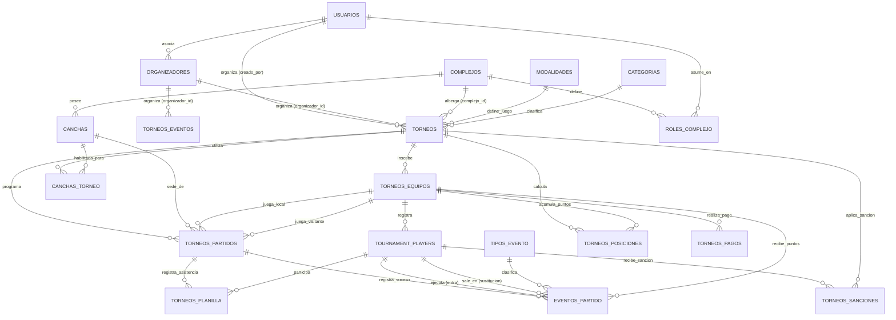

# 🏆 Modelo Entidad-Relación (MER) — Sistema de Gestión de Torneos Deportivos (Equipos por Torneo)
**DBA / Arquitecto de Software Senior — Antigravity**  
**Estándar:** 3ra Forma Normal (3NF) · PostgreSQL-compatible · Soporte Multitenant  
**Actualizado:** 2026-07-01 — Post-Migración 009

---

## 📐 Diagrama de Relaciones (Mermaid)

---

## 🗂️ CATÁLOGO DE TABLAS Y CAMPOS

### 1. `usuarios` (Global)
Gestiona el acceso de administradores, organizadores y veedores.

| Campo | Tipo | Nulos | Restricción | Descripción |
|---|---|---|---|---|
| `id` | `INTEGER` | NOT NULL | PRIMARY KEY | Identificador único |
| `nombre` | `VARCHAR(100)` | NOT NULL | — | Nombre del usuario |
| `apellido` | `VARCHAR(100)` | NOT NULL | — | Apellido del usuario |
| `email` | `VARCHAR(255)` | NOT NULL | UNIQUE | Correo electrónico de acceso |
| `password_hash` | `VARCHAR(255)` | NOT NULL | — | Hash de la contraseña |
| `activo` | `BOOLEAN` | NOT NULL | DEFAULT TRUE | Estado de la cuenta |

---

### 2. `complejos` (Tenants)
Cada predio o complejo deportivo que actúa como un "tenant" (multitenancy).

| Campo | Tipo | Nulos | Restricción | Descripción |
|---|---|---|---|---|
| `id` | `UUID` | NOT NULL | PRIMARY KEY | Identificador del complejo |
| `nombre` | `VARCHAR(200)` | NOT NULL | — | Nombre del complejo |
| `direccion` | `TEXT` | NOT NULL | — | Dirección del complejo |
| `activo` | `BOOLEAN` | NOT NULL | DEFAULT TRUE | Si está activo |

---

### 3. `roles_complejo` (Multitenancy)
Define qué rol tiene un usuario dentro de un complejo/tenant específico.

| Campo | Tipo | Nulos | Restricción | Descripción |
|---|---|---|---|---|
| `id` | `UUID` | NOT NULL | PRIMARY KEY | Identificador único |
| `complejo_id` | `UUID` | NOT NULL | FK → `complejos(id)` | Complejo/Tenant |
| `usuario_id` | `INTEGER` | NOT NULL | FK → `usuarios(id)` | Usuario |
| `rol` | `VARCHAR(30)` | NOT NULL | CHECK (rol IN ('superadmin', 'admin_complejo', 'organizador', 'veedor')) | Rol específico |
| `activo` | `BOOLEAN` | NOT NULL | DEFAULT TRUE | Si el rol está vigente |

---

### 4. `modalidades` (Lookup)
Formatos de juego soportados.

| Campo | Tipo | Nulos | Restricción | Descripción |
|---|---|---|---|---|
| `id` | `SMALLINT` | NOT NULL | PRIMARY KEY | Identificador autoincremental |
| `codigo` | `VARCHAR(30)` | NOT NULL | UNIQUE | Ej: `LIGA`, `PLAYOFF`, `MIXTO`, `SUIZO` |
| `nombre` | `VARCHAR(100)` | NOT NULL | — | Nombre legible |
| `descripcion` | `TEXT` | NULL | — | Descripción del formato |

---

### 5. `categorias` (Lookup)
Divisiones competitivas.

| Campo | Tipo | Nulos | Restricción | Descripción |
|---|---|---|---|---|
| `id` | `SMALLINT` | NOT NULL | PRIMARY KEY | Identificador autoincremental |
| `codigo` | `VARCHAR(30)` | NOT NULL | UNIQUE | Ej: `PRIMERA`, `SENIOR`, `FEMENINO` |
| `nombre` | `VARCHAR(100)` | NOT NULL | — | Nombre de la categoría |
| `edad_minima` | `SMALLINT` | NULL | — | Edad mínima habilitada |
| `edad_maxima` | `SMALLINT` | NULL | — | Edad máxima habilitada |

---

### 6. `tipos_evento` (Lookup) 🆕 *Migración 008*
Catálogo normalizado de tipos de suceso en un partido. Reemplaza el `CHECK` hardcodeado en `eventos_partido`.

| Campo | Tipo | Nulos | Restricción | Descripción |
|---|---|---|---|---|
| `id` | `SMALLINT` | NOT NULL | PRIMARY KEY | Identificador autoincremental |
| `codigo` | `VARCHAR(30)` | NOT NULL | UNIQUE | Ej: `GOL`, `AMARILLA`, `SUSTITUCION` |
| `nombre` | `VARCHAR(100)` | NOT NULL | — | Nombre legible |
| `descripcion` | `TEXT` | NULL | — | Descripción del tipo |
| `aplica_a` | `VARCHAR(20)` | NOT NULL | CHECK IN ('jugador', 'equipo', 'partido') | A quién aplica el evento |
| `afecta_marcador` | `BOOLEAN` | NOT NULL | DEFAULT FALSE | Si modifica el score |
| `afecta_disciplina` | `BOOLEAN` | NOT NULL | DEFAULT FALSE | Si genera sanción |
| `activo` | `BOOLEAN` | NOT NULL | DEFAULT TRUE | Si el tipo está habilitado |

**Tipos pre-cargados:**
`GOL`, `GOL_PENAL`, `AUTOGOL`, `AMARILLA`, `ROJA`, `ROJA_DIRECTA`, `DOBLE_AMARILLA`, `SUSTITUCION`, `LESION`, `TIEMPO_EXTRA`, `PENALES`, `PENAL_CONVERTIDO`, `PENAL_ERRADO`

### 7. `organizadores` (Lookup) 🆕 *Migración 009*
Catálogo de usuarios que actúan como organizadores independientes (sin complejo deportivo físico).

| Campo | Tipo | Nulos | Restricción | Descripción |
|---|---|---|---|---|
| `id` | `INTEGER` | NOT NULL | PRIMARY KEY | Identificador autoincremental |
| `usuario_id` | `INTEGER` | NOT NULL | UNIQUE, FK → `usuarios(id)` | Usuario del sistema asociado |
| `nombre` | `VARCHAR(200)` | NOT NULL | — | Nombre del evento u organización |
| `plan` | `VARCHAR(30)` | NOT NULL | DEFAULT 'basico' | Plan contratado |
| `max_torneos` | `SMALLINT` | NOT NULL | DEFAULT 3 | Cantidad máxima de torneos permitidos |
| `habilitado` | `BOOLEAN` | NOT NULL | DEFAULT TRUE | Si el organizador está habilitado |
| `creado_en` | `TIMESTAMPTZ` | NOT NULL | DEFAULT now() | Fecha de registro |

---

### 8. `torneos`
Centraliza la información de un torneo asociado a un complejo (tenant) o a un organizador independiente.

| Campo | Tipo | Nulos | Restricción | Descripción |
|---|---|---|---|---|
| `id` | `UUID` | NOT NULL | PRIMARY KEY | Identificador único |
| `complejo_id` | `UUID` | NULL | FK → `complejos(id)` | Tenant dueño del torneo (opcional si es organizador libre) |
| `organizador_id` | `INTEGER` | NULL | FK → `organizadores(id)` | 🆕 FK al organizador independiente (opcional) |
| `modalidad_id` | `SMALLINT` | NULL | FK → `modalidades(id)` | Sistema de juego |
| `categoria_id` | `SMALLINT` | NULL | FK → `categorias(id)` | Categoría del torneo |
| `creado_por` | `INTEGER` | NULL | FK → `sistema.usuarios(id)` | Organizador que creó el torneo |
| `nombre` | `VARCHAR(200)` | NOT NULL | — | Nombre del torneo |
| `slug` | `VARCHAR(170)` | NULL | UNIQUE | URL para acceso público |
| `estado` | `VARCHAR(30)` | NOT NULL | DEFAULT 'abierto' | `abierto`, `en_curso`, `finalizado` |
| `puntos_victoria` | `SMALLINT` | NOT NULL | DEFAULT 3 | Pts por victoria |
| `puntos_empate` | `SMALLINT` | NOT NULL | DEFAULT 1 | Pts por empate |
| `puntos_derrota` | `SMALLINT` | NOT NULL | DEFAULT 0 | Pts por derrota |
| `max_equipos` | `INTEGER` | NOT NULL | DEFAULT 16 | Cupo máximo de equipos |
| `costo_inscripcion` | `NUMERIC` | NOT NULL | DEFAULT 0 | Arancel de inscripción |
| `es_publico` | `BOOLEAN` | NOT NULL | DEFAULT TRUE | Landing pública habilitada |
| `limite_deuda_habilitado` | `BOOLEAN` | NOT NULL | DEFAULT FALSE | Bloqueo por deuda límite (Mig. 012) |
| `limite_deuda_monto` | `NUMERIC` | NULL | DEFAULT 0 | Monto límite de bloqueo (Mig. 012) |
| `multa_amarilla_monto` | `NUMERIC` | NULL | DEFAULT 0 | Monto de multa amarilla (Mig. 012) |
| `multa_roja_monto` | `NUMERIC` | NULL | DEFAULT 0 | Monto de multa roja (Mig. 012) |

---

### 8.5 `cuenta_corriente_equipos` 🆕 *Migración 012*
Manejo financiero de los equipos del torneo, deudas y cargos.

| Campo | Tipo | Nulos | Restricción | Descripción |
|---|---|---|---|---|
| `id` | `UUID` | NOT NULL | PRIMARY KEY | Identificador único |
| `torneo_id` | `UUID` | NOT NULL | FK → `torneos(id)` | Torneo relacionado |
| `equipo_id` | `UUID` | NOT NULL | FK → `torneos_equipos(id)` | Equipo en cuestión |
| `concepto` | `VARCHAR(100)` | NOT NULL | — | Detalle del cargo/pago |
| `monto` | `NUMERIC(12,2)`| NOT NULL | — | Monto adeudado o pagado |
| `estado` | `VARCHAR(20)` | NOT NULL | DEFAULT 'pendiente' | `pendiente`, `pagado` |
| `partido_id` | `UUID` | NULL | FK → `torneos_partidos(id)` | Partido origen (opcional) |
| `creado_en` | `TIMESTAMPTZ` | NOT NULL | DEFAULT now() | Fecha de registro |

---

### 9. `torneos_equipos` (Equipos por Torneo)
**Nota de negocio:** Un equipo se registra por torneo. "Lazio" del Torneo A es una fila diferente de "Lazio" del Torneo B.

| Campo | Tipo | Nulos | Restricción | Descripción |
|---|---|---|---|---|
| `id` | `UUID` | NOT NULL | PRIMARY KEY | Identificador único |
| `torneo_id` | `UUID` | NOT NULL | FK → `torneos(id)` | Torneo en el que compite |
| `nombre` | `VARCHAR(150)` | NOT NULL | — | Nombre del equipo en este torneo |
| `logo_url` | `VARCHAR(500)` | NULL | — | Escudo del equipo para este torneo |
| `color_principal` | `CHAR(7)` | NULL | — | Color primario en este torneo |
| `color_secundario` | `CHAR(7)` | NULL | — | Color secundario en este torneo |
| `estado_inscripcion` | `VARCHAR(20)` | NOT NULL | DEFAULT 'pendiente' | `pendiente`, `confirmado`, `descalificado` |

---

### 10. `tournament_players` (Jugadores por Equipo de Torneo)
Roster o lista de buena fe de jugadores inscritos para un equipo en un torneo específico.

| Campo | Tipo | Nulos | Restricción | Descripción |
|---|---|---|---|---|
| `id` | `UUID` | NOT NULL | PRIMARY KEY | Identificador único |
| `torneo_equipo_id` | `UUID` | NOT NULL | FK → `torneos_equipos(id)` | Equipo al que pertenece en el torneo |
| `nombre` | `VARCHAR(200)` | NOT NULL | — | Nombre del jugador |
| `dni` | `VARCHAR(20)` | NOT NULL | — | DNI (único por equipo en torneo) |
| `numero_camiseta` | `SMALLINT` | NULL | — | Número de camiseta asignada |
| `posicion` | `VARCHAR(40)` | NULL | — | Posición de juego |
| `face_encoding` | `JSONB` | NULL | — | Vector facial para acreditación |
| `estado` | `VARCHAR(20)` | NOT NULL | DEFAULT 'habilitado' | `habilitado`, `suspendido`, `inhabilitado` |

---

### 11. `torneos_partidos`
Encuentros programados y disputados.

| Campo | Tipo | Nulos | Restricción | Descripción |
|---|---|---|---|---|
| `id` | `UUID` | NOT NULL | PRIMARY KEY | Identificador único |
| `torneo_id` | `UUID` | NOT NULL | FK → `torneos(id)` | Torneo del fixture |
| `cancha_id` | `UUID` | NULL | FK → `canchas(id)` | Cancha donde se juega |
| `equipo_local_id` | `UUID` | NOT NULL | FK → `torneos_equipos(id)` | Local |
| `equipo_visitante_id` | `UUID` | NOT NULL | FK → `torneos_equipos(id)` | Visitante |
| `fecha_hora` | `TIMESTAMPTZ` | NULL | — | Fecha y hora programada del partido |
| `goles_local` | `INTEGER` | NULL | — | Marcador local |
| `goles_visitante` | `INTEGER` | NULL | — | Marcador visitante |
| `jornada` | `SMALLINT` | NULL | — | Fecha numérica (ej: 1, 2, 3) |
| `fase` | `VARCHAR(60)` | NULL | — | Nombre de la fase/ronda |
| `estado` | `VARCHAR(30)` | NOT NULL | DEFAULT 'programado' | `programado`, `en_curso`, `finalizado`, `wo` |

---

### 12. `eventos_partido` (Unificado)
Eventos cronometrados del partido (goles, tarjetas, sustituciones, etc.).

| Campo | Tipo | Nulos | Restricción | Descripción |
|---|---|---|---|---|
| `id` | `UUID` | NOT NULL | PRIMARY KEY | Identificador único |
| `partido_id` | `UUID` | NOT NULL | FK → `torneos_partidos(id)` | Partido |
| `tipo_evento_id` | `SMALLINT` | NULL | FK → `tipos_evento(id)` | FK al catálogo normalizado |
| `player_id` | `UUID` | NULL | FK → `tournament_players(id)` | Jugador involucrado (en SUSTITUCION: el que **entra**) |
| `player_out_id` | `UUID` | NULL | FK → `tournament_players(id)` | Para SUSTITUCION: jugador que **sale** |
| `equipo_id` | `UUID` | NOT NULL | FK → `torneos_equipos(id)` | Equipo del evento |
| `tipo` | `VARCHAR(25)` | NOT NULL | — | Código del tipo (ej: `GOL`, `AMARILLA`) |
| `minuto` | `SMALLINT` | NOT NULL | CHECK >= 0 AND <= 150 | Minuto del suceso |
| `periodo` | `SMALLINT` | NOT NULL | DEFAULT 1 | Primer o segundo tiempo |
| `es_tiempo_adicional` | `BOOLEAN` | NOT NULL | DEFAULT FALSE | Si ocurrió en tiempo adicional |
| `observaciones` | `TEXT` | NULL | — | Notas libres del veedor |

---

## 📈 LÓGICA DE CARDINALIDAD E INTEGRIDAD
- **`torneos_equipos` y `tournament_players`** aseguran que los rosters y equipos estén perfectamente aislados. Si "Lazio" juega el Torneo Apertura y luego el Torneo Clausura, se registran como dos entidades diferentes de equipo en `torneos_equipos` (con IDs únicos).
- **`tipos_evento`** como catálogo normalizado permite agregar nuevos tipos de evento con un simple `INSERT` sin necesidad de alterar el esquema de la base de datos.
- **`eventos_partido.player_out_id`** permite registrar sustituciones correctamente indicando tanto al jugador que entra (`player_id`) como al que sale (`player_out_id`), sin duplicar registros.
- **`torneos.creado_por`** permite que los organizadores consulten sus torneos directamente sin necesidad de resolver la cadena usuario → rol → complejo → torneos.
- El **recalculador de posiciones** y la **planilla digital** apuntan directamente a estos IDs locales, eliminando la necesidad de manejar históricos de pases o resolver conflictos de nombres iguales de clubes entre torneos distintos.
- **`cancha.organizadores`** ofrece soporte directo para registrar y habilitar organizadores libres o independientes que no poseen local deportivo, manteniendo el esquema flexible y limpio.

---

### 13. `noticias_torneo`
Crónicas y noticias del torneo generadas (manual o IA).

| Campo | Tipo | Nulos | Restricción | Descripción |
|---|---|---|---|---|
| `id` | `UUID` | NOT NULL | PRIMARY KEY | Identificador único |
| `torneo_id` | `UUID` | NOT NULL | FK -> `torneos(id)` | Torneo |
| `titulo` | `VARCHAR(255)` | NOT NULL | - | Título de la noticia |
| `contenido` | `TEXT` | NOT NULL | - | Cuerpo de la noticia |
| `autor` | `VARCHAR(100)` | NULL | - | Autor |
| `es_ia` | `BOOLEAN` | NOT NULL | DEFAULT FALSE | Generada por Gemini |
| `prompt_usado` | `TEXT` | NULL | - | Prompt original |
| `fecha_publicacion` | `TIMESTAMPTZ` | NOT NULL | DEFAULT NOW() | Fecha de publicación |

